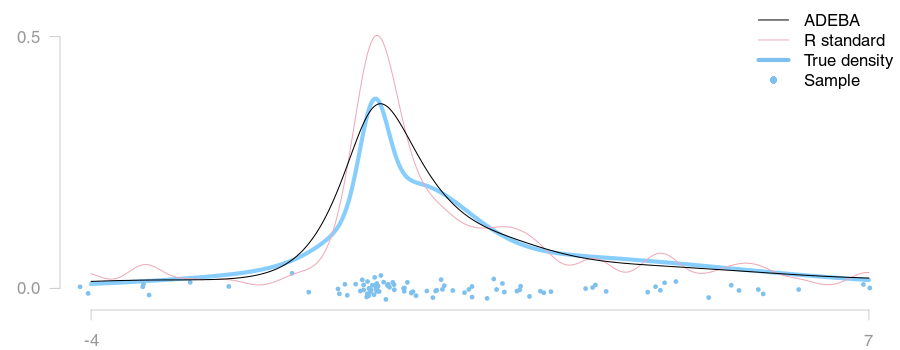

Adaptive density estimation by Bayesian averaging
=====
This repo contains an R implementation of the ADEBA density estimation method
and a benchmark study comparing it to a number of other methods.

More details on ADEBA and a reference to the original article will be posted here
once it has been accepted by a scientific journal (under review at the moment).


## Installation
Latest release version:

```
R> install.packages("CRAN")
```

Latest dev version (currently the same):

```
library(devtools)
install_github("backlin/ADEBA/adeba")
```

Some extra plot functionality is provided in the support package [`adebaExtra`](./adebaExtra).


## Key features
The ADEBA family of estimators has two features that differentiates it from traditional
estimators (those included in the base distributions of R and Matlab).
These are demonstrated below.


### Adaptive bandwith estimation
ADEBA has two hyperparameters, one that sets the overall bandwidth and one that adjusts
it to the local data density of each kernel. This allows it to:

Capture sharp modes:

```
pic here plz
```

Remove spurious modes in the tails:




### Multivariate estimation
ADEBA extends naturally to multivariate densities.

